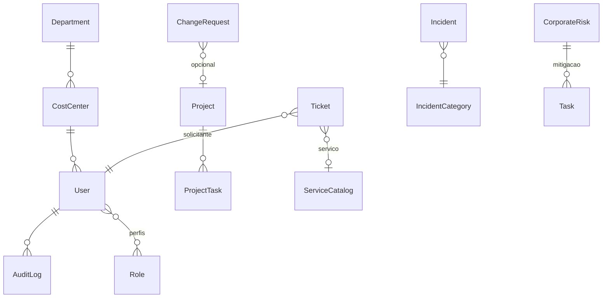

# G360 / ITBM — Documentação da estrutura da base de dados

Este documento descreve o **modelo de dados** definido em Prisma (`BACKEND/src/prisma/schema.prisma`), alvo **PostgreSQL**. Serve como referência de entidades, relações e convenções — **não substitui** migrations nem o ficheiro `.prisma` como fonte de verdade.

---

## 1. Visão geral

| Aspeto | Descrição |
|--------|-----------|
| **SGBD** | PostgreSQL |
| **ORM** | Prisma 5 (`@prisma/client`) |
| **Multi-tenant** | Tabela `Tenant` e configurações globais no schema **`public`**; **cada empresa (tenant)** possui um **schema PostgreSQL dedicado** (`schemaName` em `Tenant`) com uma instância completa das tabelas de negócio (utilizadores, projetos, tickets, etc.). |
| **Ficheiro canónico** | `BACKEND/src/prisma/schema.prisma` |
| **Conexão** | `DATABASE_URL` (variável de ambiente) |

Fluxo típico: a aplicação resolve o cliente Prisma para o schema do tenant corrente (JWT / tenant); operações de **super-admin** sobre o catálogo de tenants usam o client do schema `public`.

---

## 2. Schema `public` (catálogo global)

| Modelo Prisma | Tabela física (`@@map`) | Função |
|-----------------|-------------------------|--------|
| **Tenant** | `tenants` | Empresas: `slug`, `schema_name`, plano, `max_users`, `enabled_modules` (JSON), estado. |
| **GlobalSetting** | `global_settings` | Pares `category` + `key` + `value` para parâmetros da plataforma. |

Estas entidades **não** se repetem por schema de tenant.

---

## 3. Modelos por schema de tenant

Todas as tabelas abaixo existem **em cada schema de tenant** (cópia lógica do mesmo modelo Prisma). Chaves primárias são em geral **UUID** (`String @id @default(uuid())`), salvo excepções indicadas.

### 3.1 Identidade, acesso e auditoria

| Modelo | Tabela / notas | Descrição resumida |
|--------|----------------|---------------------|
| **User** | — | Utilizador: email, nome, password opcional, Azure, departamento, centro de custo, `authProvider`, preferências de notificação (JSON), relações com perfis e módulos. |
| **RefreshToken** | — | Tokens de refresco; revogação, expiração, IP/UA. |
| **Role** | — | Perfis (nome único). |
| **Permission** | — | `module` + `action` por `roleId` (único composto). |
| **ApprovalTier** | — | Alçadas de aprovação por `entityType`, `roleId`, faixas de valor (`minAmount`/`maxAmount`), `globalScope`. |
| **Department** | — | Departamentos; hierarquia (`parentId`), director. |
| **CostCenter** | — | Centros de custo; `managerId`, ligação opcional a departamento. |
| **AuditLog** | — | Trilha: `action`, `module`, `entityId`, `entityType`, `oldData`/`newData` (JSON), utilizador, IP, UA. |
| **LoginAttempt** | — | Controlo de tentativas de login por email (bloqueio). |

### 3.2 Fornecedores e contratos

| Modelo | Descrição resumida |
|--------|---------------------|
| **Supplier** | Fornecedor: documento único, classificação, dados bancários opcionais, rating, status. |
| **Contract** | Contrato: fornecedor, CC, conta, valores, datas, `alertDays`, estado, renovação. |
| **ContractAttachment** | Anexos do contrato. |
| **ContractAddendum** | Aditivos contratuais. |

### 3.3 Ativos e licenças

| Modelo | Descrição resumida |
|--------|---------------------|
| **AssetCategory** | Categorias de ativo (tipo, depreciação). |
| **Asset** | Ativo: código único, categoria, fornecedor/contrato/CC opcionais, vínculos com GMUD (`AssetToChangeRequest`), incidentes, riscos, tickets. |
| **AssetMaintenance** | Manutenções do ativo. |
| **SoftwareLicense** | Licenças de software (quantidade, expiração, custo). |

### 3.4 Financeiro e orçamento

| Modelo | Descrição resumida |
|--------|---------------------|
| **AccountingAccount** | Plano de contas; hierarquia `parentId`; CC opcional. |
| **FiscalYear** | Exercício fiscal; `isClosed`. |
| **Budget** | Orçamento por exercício: OPEX/CAPEX agregados, estado, tipo (ex. `MIXED`), cenários. |
| **BudgetScenario** | Cenário “what-if” ligado ao orçamento. |
| **BudgetScenarioItem** | Linhas mensais (jan–dez) por cenário. |
| **BudgetItem** | Itens mensais do orçamento base; conta, CC, fornecedor opcional. |
| **Expense** | Despesas: aprovação, NF, fluxo com campos de lições/causa raiz quando aplicável. |

### 3.5 Projetos (PPM)

| Modelo | Descrição resumida |
|--------|---------------------|
| **Project** | Projeto: código único, estado, aprovação, gestor, tech lead, criador, CC, ligação a tickets e mudanças. |
| **ProjectTask** | Tarefas do projeto: checklist JSON, dependências, assignee. |
| **ProjectTaskComment** / **ProjectTaskAttachment** | Comentários e anexos da tarefa de projeto. |
| **ProjectMember** | Membros (`projectId`, `userId`, papel) — único por par. |
| **ProjectRisk** | Riscos específicos do projeto. |
| **ProjectProposal** | Propostas de fornecedor; estados (ex. RASCUNHO, aprovação); ligação a custos. |
| **MeetingMinute** | Atas: aprovação, ficheiro, tópicos. |
| **ProjectFollowUp** | Follow-ups / ações de acompanhamento. |
| **ProjectCost** | Custos do projeto; proposta opcional; aprovação. |

### 3.6 Tarefas gerais (módulo TASKS)

| Modelo | Descrição resumida |
|--------|---------------------|
| **Task** | Tarefa pessoal ou de equipa; `riskId` opcional (mitigação ERM); checklist JSON. |
| **TaskComment** / **TaskAttachment** | Comentários e anexos. |
| **TaskTimeLog** | Registo de tempo (início/fim, duração em segundos). |

### 3.7 Gestão de mudança (GMUD)

| Modelo | Descrição resumida |
|--------|---------------------|
| **ChangeRequest** | RFC: código único, estados, janelas, risco (`riskAssessment` JSON), PIR (`rootCause`, `lessonsLearned`), incidente relacionado, ativos N:N, tickets. |
| **ChangeTemplate** | Templates reutilizáveis. |
| **ChangeAttachment** / **ChangeComment** / **ChangeApprover** | Anexos, comentários, aprovadores (único por mudança+utilizador). |
| **AffectedService** | Serviços afetados pela mudança. |
| **FreezeWindow** | Janelas de congelamento (nome, datas, ativo). |

### 3.8 Notificações e integrações

| Modelo | Descrição resumida |
|--------|---------------------|
| **Notification** | Notificações in-app: `link`, `eventCode`, `dedupeKey`, tipo, entidade. |
| **Integration** | Configuração por `type` (LDAP, e-mail, Azure, etc.): `config` JSON. |

### 3.9 Base de conhecimento

| Modelo | Descrição resumida |
|--------|---------------------|
| **KnowledgeCategory** | Categorias de artigos. |
| **KnowledgeBase** | Artigos: conteúdo, tags, views, autor. |
| **KnowledgeBaseAttachment** | Anexos do artigo. |

### 3.10 Incidentes (ITIL)

| Modelo | Descrição resumida |
|--------|---------------------|
| **IncidentCategory** | Categoria com SLA de resposta/resolução (minutos). |
| **Incident** | Incidente: código único, impacto/urgência/prioridade, SLA, reporter/assignee, ativo e mudança relacionados, histórico. |
| **IncidentComment** / **IncidentAttachment** / **IncidentHistory** | Comentários (interno/público), anexos, histórico de alterações. |

### 3.11 Riscos corporativos (ERM)

| Modelo | Descrição resumida |
|--------|---------------------|
| **CorporateRisk** | Risco: código único, probabilidade/impacto, severidade, tratamento, dono, departamento/CC/ativo/fornecedor, normas; tarefas de mitigação via `Task`. |

### 3.12 Help Desk e problemas

| Modelo | Tabela física (`@@map`) | Descrição resumida |
|--------|-------------------------|---------------------|
| **Ticket** | — | Chamado: código único (ex. HD-AAAA-NNNN), categoria, serviço, grupo de suporte, solicitante/atribuído, SLA (pausa, minutos pausados), CSAT, vínculos projeto/mudança/problema, respostas JSON do formulário. |
| **TicketCodeSequence** | — | Sequência anual por ano (`year` PK) para códigos HD. |
| **HelpdeskConfig** | `helpdesk_config` | Configuração única: calendário de negócio, `auto_assign_on_create`, JSON de calendário. |
| **SupportGroup** | `support_groups` | Grupos N1/N2; SLA opcional; cursor round-robin. |
| **SupportGroupMember** | `support_group_members` | Membros do grupo. |
| **TicketMessage** | — | Mensagens no ticket; anexos ligados à mensagem ou ao ticket. |
| **TicketAttachment** | — | Anexos (mensagem opcional). |
| **TicketCategory** | — | Categorias de chamado. |
| **ServiceCatalog** | — | Serviços do catálogo: `formSchema` JSON, SLA, categoria. |
| **SlaPolicy** | — | Políticas de SLA (minutos resposta/resolução). |
| **ProblemRequest** | — | Problema ITIL: código, estado, solicitante; tickets associados (`problemId`). |

---

## 4. Relações transversais (resumo)

- **User** é centro de gravidade: liga a incidentes, tickets, projetos, tarefas, riscos, auditoria, notificações, etc.
- **CostCenter** e **Department** estruturam **escopo** organizacional e financeiro.
- **Asset** liga-se a incidentes, tickets, GMUD (N:N), riscos.
- **Ticket** liga-se a **ProblemRequest**, **ChangeRequest**, **Project**, **Asset**, políticas **SlaPolicy** e **ServiceCatalog**.
- **CorporateRisk** liga-se a **Task** para mitigação e a fornecedor/ativo/CC/departamento quando aplicável.

---

## 5. Convenções e tipos

- **Datas:** `DateTime` com `@default(now())` / `@updatedAt` onde aplicável.
- **Decimais:** `Decimal` com `@db.Decimal(18, 2)` em valores monetários (ex.: orçamento, despesas).
- **JSON:** campos `Json` para formulários dinâmicos, preferências, questionários de risco, calendário de helpdesk, etc.
- **Soft delete / estado:** muitos domínios usam campos `status` ou `isActive` em vez de apagar registos.
- **Índices:** definidos em campos frequentemente filtrados (`@@index` em tokens, tickets, notificações, etc.).

---

## 6. Diagrama de dependências (alto nível)

---

## 7. Manutenção deste documento

- Ao **adicionar ou alterar modelos** no Prisma, actualize este ficheiro ou regenere a partir do `schema.prisma`.
- Comandos úteis: `npx prisma validate`, `npx prisma migrate dev`, `npx prisma generate`.
- Para inspecção visual: **Prisma Studio** (`npm run prisma:studio` no `BACKEND`).

---

*Gerado com base em `BACKEND/src/prisma/schema.prisma`. Última revisão estrutural: alinhada ao repositório ITBM / g360-backend.*
